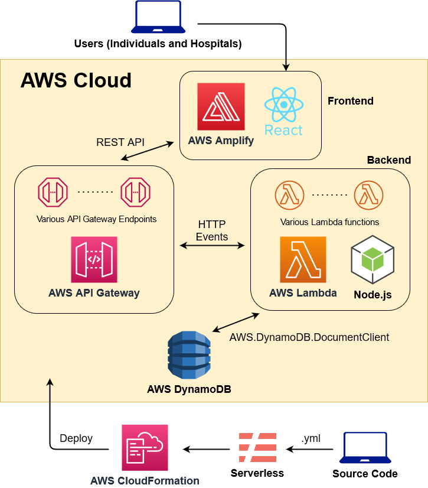
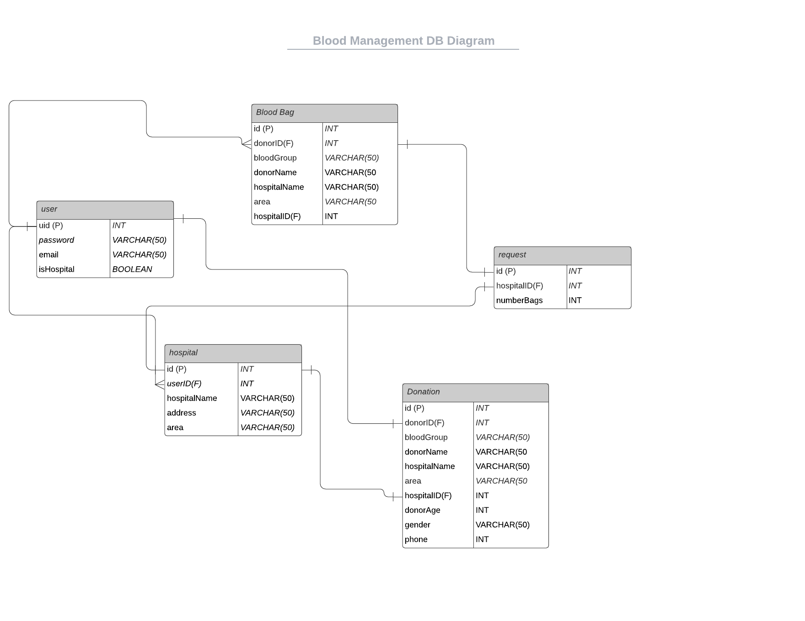

## ECE 465 Cloud Computing
### Final Project - Blood Managment SaaS Application with Amplify, React, Node.js, Lambda, Serverless, DynamoDB

##### Built by [Kevin Jiang](https://github.com/kevinjiang11579) and [Crystal Yuecen Wang](https://github.com/CrystalWang1225)
##### Advised by Professor Rob Marano

### Purpose 
The purpose of the project is to develop a blood bag management software-as-a-service (SaaS) to help facilitate the collection and distribution of the blood bags across a vast network of blood donation centers. The software is implemented in a distributed fashion, with the frontend, backend, and database all being hosted on cloud. Being distributed allows our software and databases to be rapidly scalable, which is essential in order to service a vast network of blood donation centers at the same time. Rather than having each blood donation center use its own blood management system, our software allows many donation centers to communicate with each other through a common system. This is important for allowing one donation center to quickly and efficiently assist other donation centers in cases of blood bag shortages, as well was allowing donation centers within the same city to maintain a balance of the quanitity of blood bags of each blood type. Our software also allows individuals in need of blood bags to check the availability of bloodbags from many donation centers, rather than just one donation center at a time. Because the information of many donation centers are stored within the cloud database, the software can also recommend to individual donors which donation center has the largest need for their blood type.
### Interface 
The blood management system is deployed using AWS amplify to support the React frontend as the framework. The backend service uses the Serverless Framework, which uses AWS CloudFormation to deploy the service onto the AWS cloud. The specific AWS services that are used for the backend are Lambda and DynamoDB. Lambda is a serverless compute PaaS that runs backend code without the need for us to manage and allocate servers. Lambda automatically scales the amount of resources used to match the amount of work being done by the backend service, and Lambda functions allow the backend service to easily interface and communicate with DynamoDB. DynamoDB is a NoSQL distributed database service managed by AWS, and the backend service utilizes several DynamoDB Tables in order to store information of essential to the blood management system. The Lambda functions are written using Node.js.
### System Overview 

  
  
 
  
### Functionalities 
Our blood management software is usable by two types of user accounts: individual accounts and hospital accounts (blood donation centers).  
Individual accounts can view a list of all available blood bags in all of the hospitals using the software. They can filter the list by blood type, and request a blood bag from this list. Requesting a blood bag removes the blood bag from the lists of other users. They can register for a blood donation of a certain blood type, which sets an appointment for blood donation at a hospital of their choice. When an individual  registers for a donation, the software uses a recommendation algorithm based on the individual's selected blood type. The hospital with the most need for their blood type will be shown at the top of the list of hospitals that the individual can choose from. More than one individual can use a single individual account, so there may be multiple people who register for blood donations from a single individual account. Finally, individual accounts can view their appointments for blood donations and requests for blood bags. 
Hospital accounts can view a list of blood bags stores in the hospital associated with the account. They can associate a hospital with the account through a quick form. They can also view donation appointments at their hospital. Additionally, hospitals can post an urgent request for more blood bags of a certain blood type. After the request is posted, other hospital accounts will be able to see the request as well as which hospital posted it. This allows hospitals to comunicate with each other and maintain ample supplies of blood bags at each hospital.

### Databases 
Our database uses multiple tables in DynamoDB to logically organize information. A user table stores user credentials and user type; this table is used for simple signup and login. A table for blood bags stores blood bag information, which includes donor information (including primary key), hospital primary key, and request flags. The hospital tables stores information for hospitals, as well as user primary keys to associate a hospital with a user. The donation tables stores donation appointment and has both user primamry keys and hospital primary keys to allow both users and hospitals to see the data. Finally, the request table functions as a posting board for emergnecy blood requests.

  
  
 
  
### [Presentation Video](https://youtu.be/2vc7vx34X70)
### [Presentaion Slides](https://github.com/CrystalWang1225/ECE-465-Cloud-Computing/blob/FinalProject/Cloud%20Computing%20Final%20Project%20Presentation.pdf)
